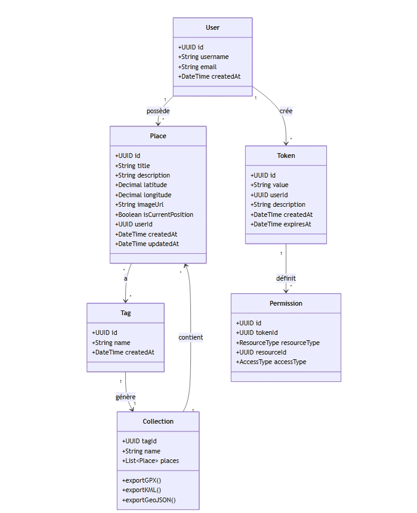

# Gestion de Lieux

Application décentralisée pour enregistrer, organiser et partager des lieux favoris (coordonnées GPS, description, tags, image), avec export/import et agrégation multi-serveurs.


## Architecture

```text
┌─────────────────┐
│  Client Mobile  │
│  (Android/iOS)  │
└────────┬────────┘
         │ HTTP / REST
┌────────▼────────┐
│   Spring Boot   │
│     REST API    │
└────────┬────────┘
         │
┌────────▼────────┐
│   H2 / SQLite   │
│   (embarquée)   │
└─────────────────┘
````

**Principes clés**

* **Client = agrégateur** : affiche *mes lieux* + *sources externes* (autres serveurs).
* **Collections automatiques** : 1 tag = 1 collection ; + une collection “Tous”.
* **Partage via token** avec droits (lecture/écriture) (ACL).

---

## Modèle de données





---

## Scénarios

### Scénario 1 — Usage basique

```text
Alice ouvre l’app
→ Voit la carte avec ses lieux
→ Clique “Ajouter un lieu”
→ Place un pin sur la carte
→ Renseigne : "Restaurant Le Bistrot"
   Tags : ["Restaurant", "Paris"]
→ Le lieu apparaît dans :
   - Tous mes lieux
   - Restaurant (créée automatiquement)
   - Paris (créée automatiquement)
```

### Scénario 2 — Export

```text
Alice veut utiliser ses restos dans Waze
→ Ouvre la collection “Restaurant”
→ Clique “Exporter”
→ Choisit GPX
→ Télécharge le fichier
→ Importe dans Waze
```

### Scénario 3 — Partage simple (collection + position courante)

```text
Alice veut montrer ses restos à Bob
→ Collection “Restaurant” → “Partager”
→ L’app génère un token : "xyz789"
→ L’app affiche : "https://alice-server.com" + token: xyz789
→ Alice envoie ça à Bob (WhatsApp, etc.)

Bob reçoit le message
→ Ouvre son app
→ Va dans “Ajouter une source”
→ Colle l’URL et le token
→ Bob voit les restos d’Alice sur sa carte
```

### Scénario 4 — Partage entre serveurs

```text
Alice (serveur alice.com)
Bob (serveur bob.com)
Charlie (serveur charlie.com)

Alice partage ses “Restos Paris” avec Bob
Bob partage ses “Bars Lyon” avec Charlie
Charlie partage ses “Musées” avec Alice

Résultat chez Alice :
Carte affichant
├── Mes lieux (alice.com)
│   ├── Restos Paris
│   └── Mes autres lieux
└── Sources externes
    └── Musées de Charlie (charlie.com)
```

---

## Interface

### Vue principale — Carte

```text
┌─────────────────────────────────┐
│ [Menu☰] Gestion Lieux    [+Lieu]│
├─────────────────────────────────┤
│                                 │
│        🗺️  CARTE                │
│     📍  📍   📍                  │
│   📍      📍                     │
│                                 │
├─────────────────────────────────┤
│ Collections:                    │
│ • Tous (45)                     │
│ • Restaurant (12)               │
│ • Paris (8)                     │
│ • Voyage (5)                    │
│                                 │
│ Sources externes:               │
│ • Bars de Bob (bob.com)         │
└─────────────────────────────────┘
```

### Fiche d’un lieu

```text
┌─────────────────────────────────┐
│ Restaurant Le Bistrot      [×]  │
├─────────────────────────────────┤
│ [Photo du restaurant]           │
│                                 │
│ 📍 48.8566, 2.3522              │
│                                 │
│ Description:                    │
│ Super resto italien...          │
│                                 │
│ Tags: #Restaurant #Paris        │
│                                 │
│ [Ouvrir dans Maps]              │
│ [Partager]                      │
│ [Modifier] [Supprimer]          │
└─────────────────────────────────┘
```

### Page de partage

```text
┌─────────────────────────────────┐
│ Partager "Restaurant"           │
├─────────────────────────────────┤
│ Générer un nouveau token:       │
│                                 │
│ Droits: ○ Lecture  ○ Écriture   │
│                                 │
│ [Générer]                       │
│                                 │
│ Tokens actifs:                  │
│ • abc123 (lecture) - Bob        │
│   https://alice.com + abc123    │
│   [Révoquer]                    │
│                                 │
│ • xyz789 (écriture) - Charlie   │
│   https://alice.com + xyz789    │
│   [Révoquer]                    │
└─────────────────────────────────┘
```

```
